# Projet-soutenance-PFA
ce projet realise par Chahid EL OTMANY, BOUYAHYI Manal , ACHRAF M'RABETI and Youssra ELHASSOUNI


# HyperTube

Ce projet vous propose de créer une application web permettant à un utilisateur de rechercher et visionner des vidéos. Le lecteur sera directement intégré au site, et les vidéos seront téléchargées au travers du protocole BitTorrent

### Stack

* Node JS (Express)
* React JS
* Material UI Front libraries
* MySQL
* JSON web tokens
* Axios for API requests

## Installation

Use the package manager [npm](https://pip.pypa.io/en/stable/) to install  client and server.

```bash
npm --prefix ./server install
npm --prefix ./client install
```
## How to launch


```bash
npm start
npm start
```
## Screenshots

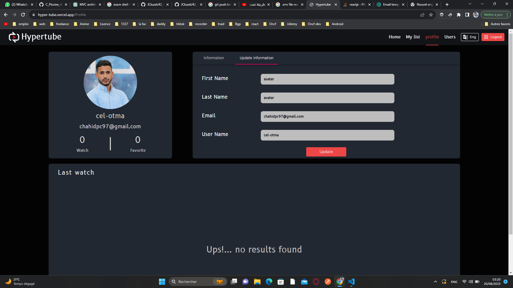</br>
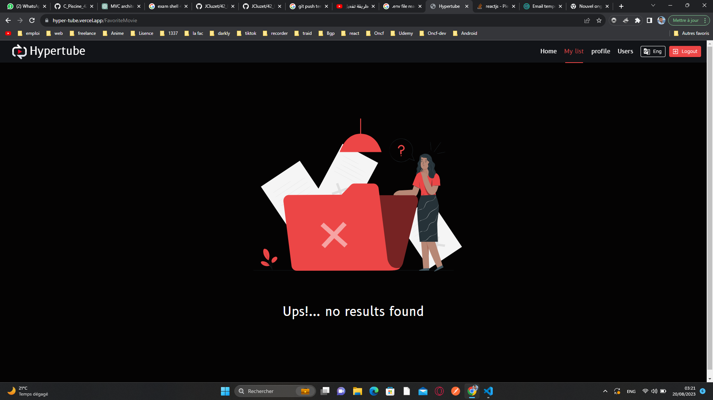
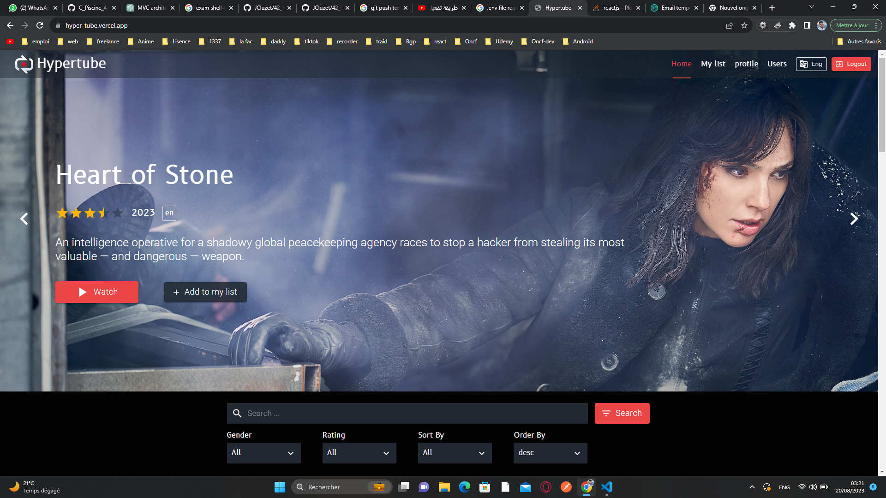</br>
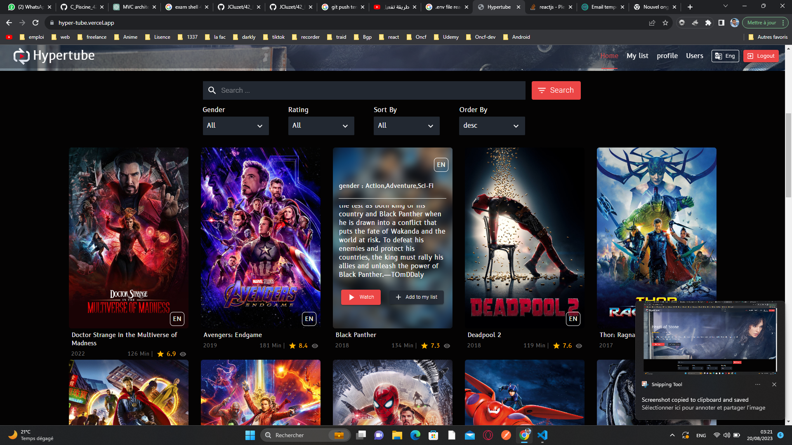
</br>
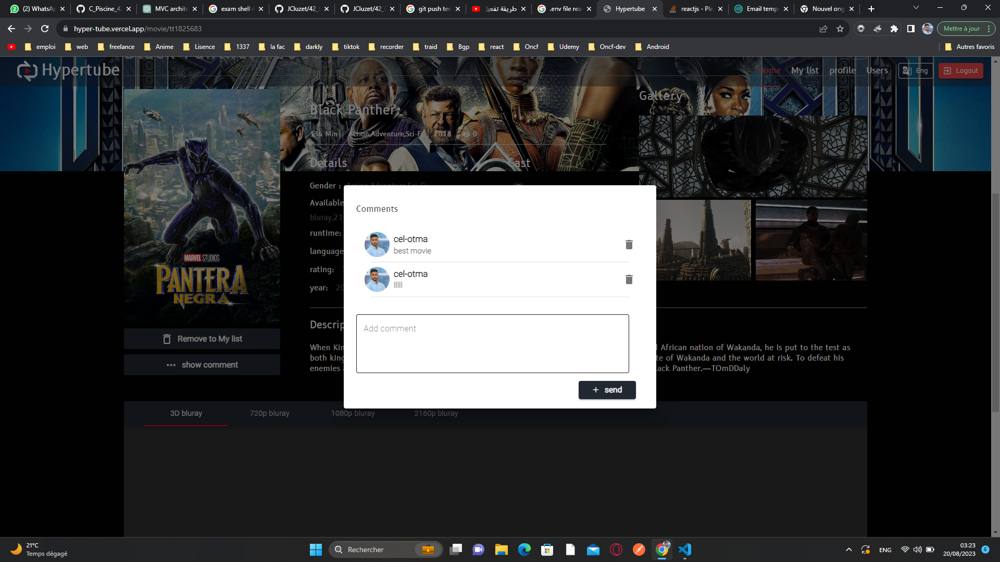
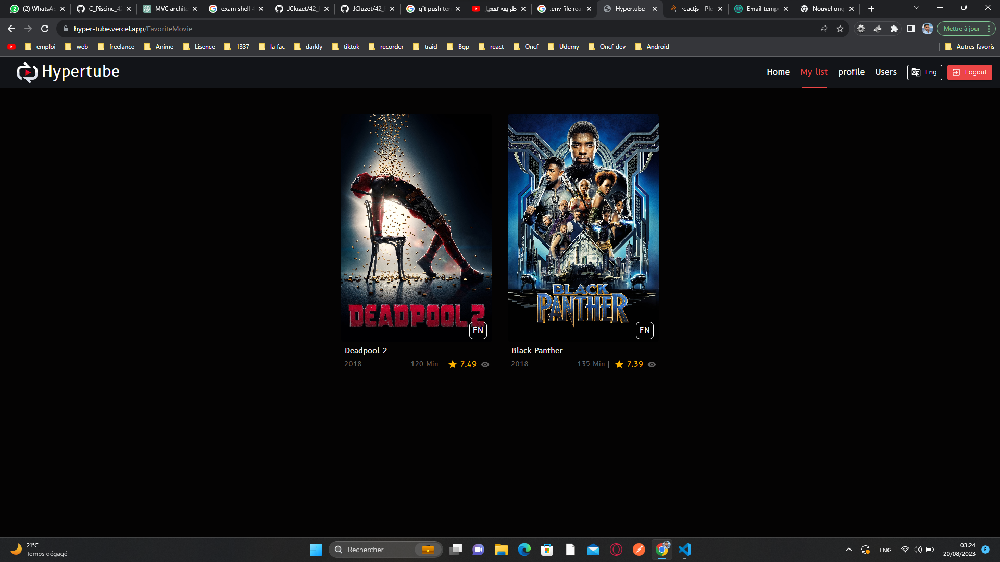</br>
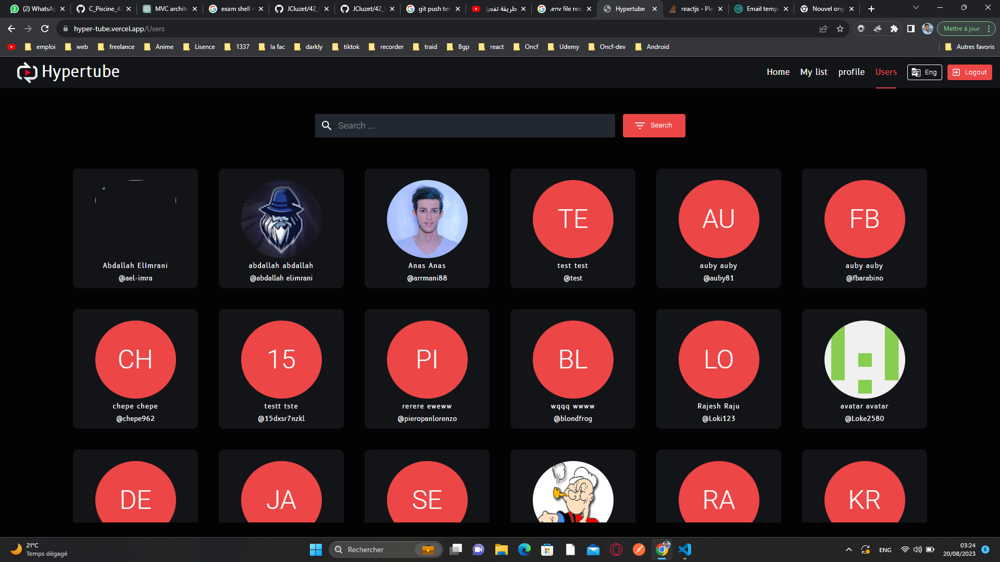
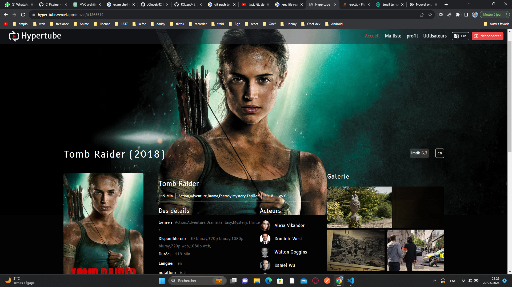</br>
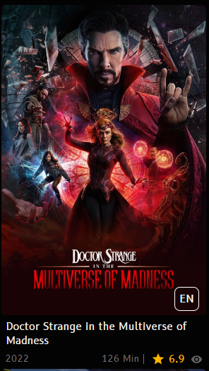</br>
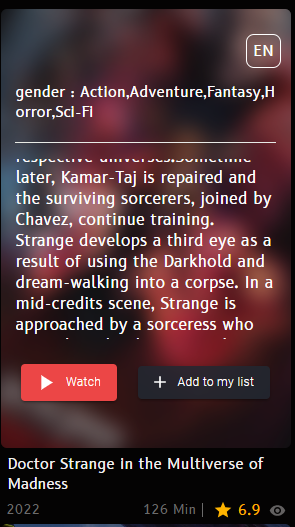</br>
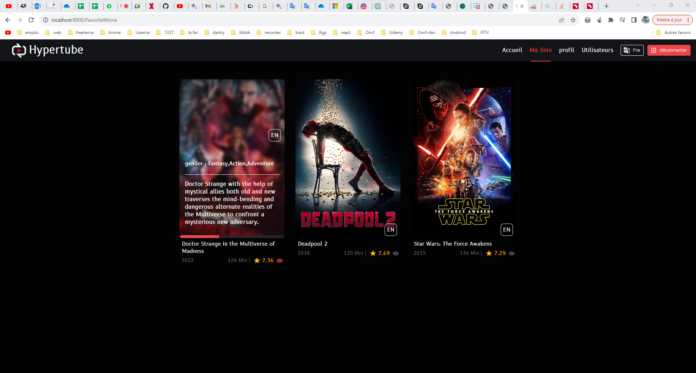</br>
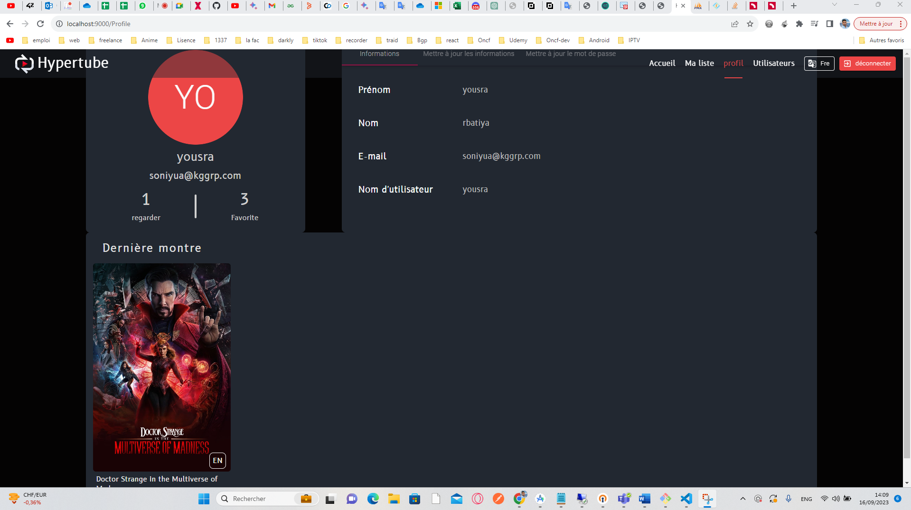</br>
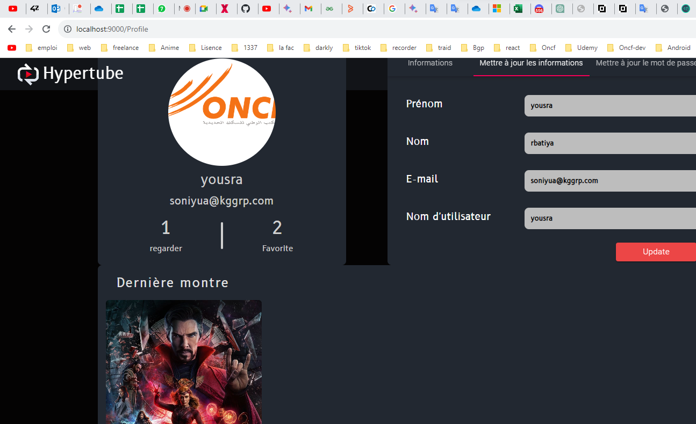</br>
</br>
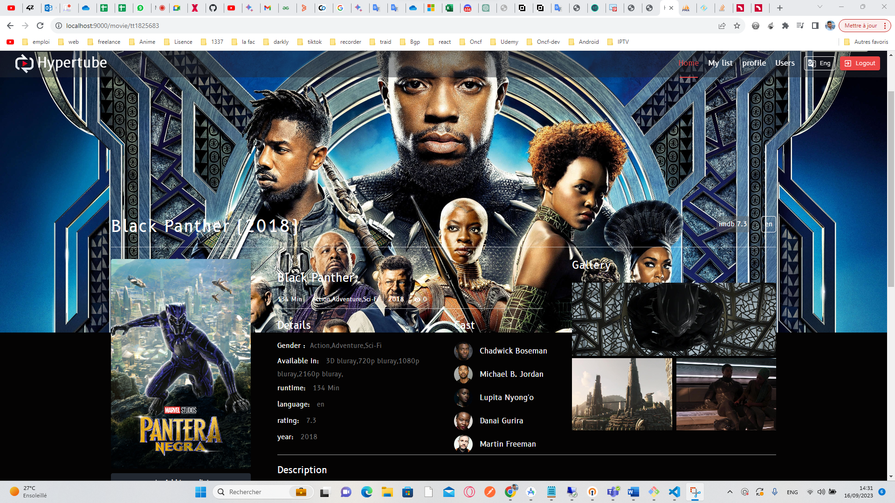</br>
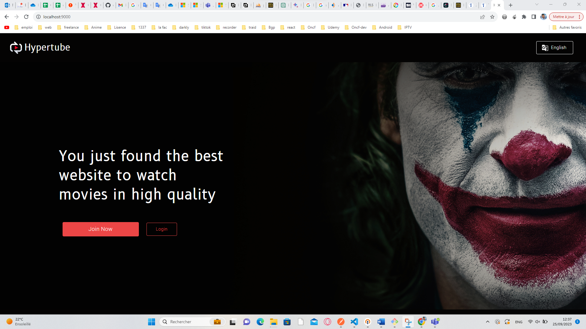</br>
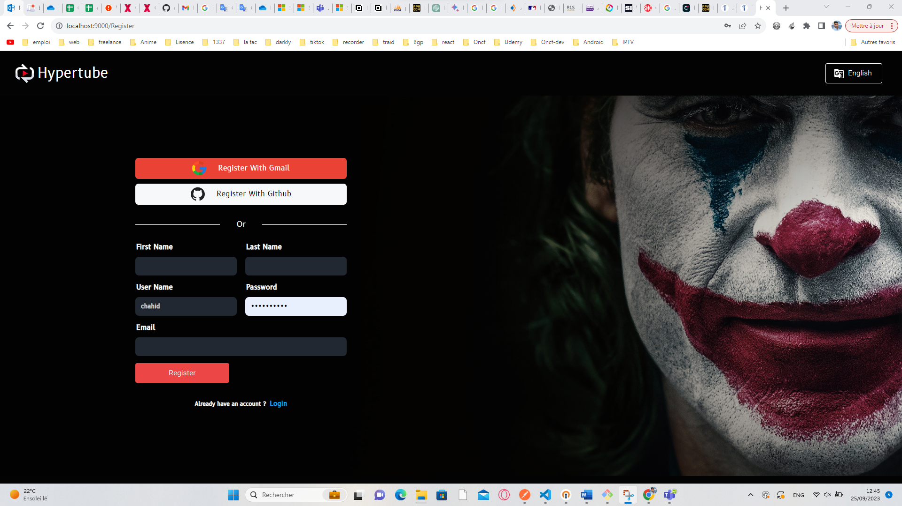</br>


## License
